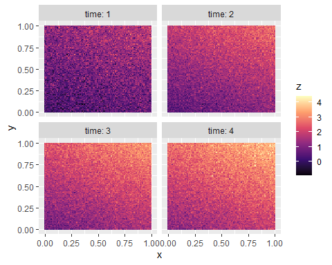
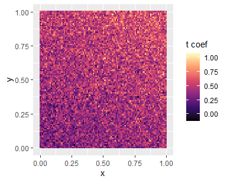
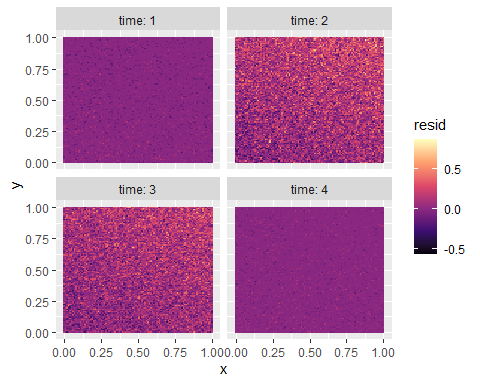

<!-- README.md is generated from README.Rmd. Please edit that file -->

## remotePARTS

<!-- badges: start -->

[](https://lifecycle.r-lib.org/articles/stages.html#stable)
[](https://www.gnu.org/licenses/gpl-3.0)
[](https://github.com/morrowcj/remotePARTS/actions)
[](https://joss.theoj.org/papers/c6a3da6a56aa0fb0e1f8a4f36cab12c2)

<!-- badges: end -->

*remotePARTS* is an software package for the *R* statistical programming
language. The package contains tools for analyzing spatiotemporal data,
typically obtained via remote sensing.

## Description

These tools were created to test map-scale hypotheses about trends in
large remotely sensed data sets, but they are useful for analyzing
trends in any spatial data, with or without a temporal component.
Statistical tests are conducted with the PARTS method for analyzing
spatially autocorrelated time series (Ives et al., 2021). The method’s
unique approach can handle extremely large data sets that other
spatiotemporal models cannot, while still appropriately accounting for
autocorrelation structure. This is done by partitioning the data into
smaller chunks, analyzing chunks separately and then combining the
separate analyses into a single test, that accounts for correlations
among chunks, of the map-scale hypotheses.

## Instalation

To install the package and it’s dependencies from CRAN, use the
following R code:

``` r
install.packages("remotePARTS")
```

To install the latest stable version of this package from github, use

``` r
remotes::install_github("morrowcj/remotePARTS")
```

and to test out the newest features and functionality, use

``` r
remotes::install_github("morrowcj/remotePARTS", ref = "develop")
```

To ensure the vignette is built when installing from GitHub, use

``` r
remotes::install_github("morrowcj/remotePARTS", build_vignettes = TRUE)
```

Then, upon successful installation, load the package with
`library(remotePARTS)`.

### Dependencies

Since the matrix operations in this package rely on C++ code, as
implemented via the [RcppEigen
package](https://github.com/RcppCore/RcppEigen), the latest version of
[Rtools](https://cran.r-project.org/bin/windows/Rtools/) is required for
Windows and C++11 is required for other systems.

<!--- Now that the package is on CRAN, I am not 100% certain that the above statement
is strictly true anymore, but I'm going to leave it for now until I learn more. --->

## Contribution, bugs, and feature requests

If you wish to contribute to this package, report bugs, suggest new
features or behavior, correct typos, update documentation, or anything
else, please submit a [GitHub
Issue](https://github.com/morrowcj/remotePARTS/issues). We welcome and
appreciate any and all feedback.

## Typical Workflow

A typical *remotePARTS* workflow is comprised of two broad steps for
analyzing trends in spatiotemporal datasets: 1) time series analysis and
2) spatial analysis. For purely spatial problems, step 1 is skipped. We
briefly summarize these steps and the expected data structure below.

#### Input data

Currently, *remotePARTS* requires that the data are formatted as “flat”
files (i.e., data frames with 1 row per pixel) with x- and
y-coordinates. We will not go into detail of how to prepare your data
here, as other packages are dedicated to reading and manipulating
spatial data (e.g., see `raster::rasterToPoints()`). We recognize that
this is a limitation, since flat files are highly inefficient. Future
versions of this package may include interfaces with raster objects if
enough users express interest.

To demonstrate the package’s basic functionality, we first simulate a
small spatiotemporal data set for analysis:

``` r
library(tibble); library(dplyr); library(tidyr); library(viridisLite)
library(ggplot2); library(remotePARTS)

# simulate a spatiotemporal response variable
sim_spatiotemp <- function(
    n, k, n_time = 4, b.0 = 0, b.x = 0.5, b.y = 1, 
    b.xy = 0.1, sd.xy = 0.2, b.t = 0.2, ar = 0.4,  
    sd.t = 0.1
){
  coords = expand_grid(
    x = seq(0, 1, length.out = n), y = seq(0, 1, length.out = k)
  )
  
  time = seq_len(n_time)
  
  tibble::tibble(
    x = coords[[1]], y = coords[[2]],
    z.0 = b.0 + x*b.x + y*b.y + x*y*b.xy,
    eps = rnorm(n = length(x), mean = 0, sd = sd.xy),
    time.effect = list(time * b.t),
  )  |> 
    rowwise() |>
    mutate(
      z.0 = z.0 + eps,
      sp.innov = list(z.0 + time.effect + rnorm(n_time, sd = sd.t)), 
      z = list(arima.sim(list(ar = ar), n_time, innov = sp.innov))
    ) |> 
    unnest_wider(z, names_sep = ".") |> 
    select(-"time.effect", -"sp.innov", -"eps")
}
```

The function defined above generates a data frame for `n` $\times$ `k`
pixels. The response variable (`z`) depends upon the `x` and `y`
coordinates of the map. The resulting spatial patterns (`z.0`) are used
as the random innovations of an AR(1) time series model to generate the
spatiotemporal response (`z.1` – `z.4`). These data are visualized
below:

``` r
# build the data
dat <- sim_spatiotemp(n = 100, k = 100)

# extract coordinates
coords <- select(dat, x, y)

# visualize the data
dat |> 
  pivot_longer(cols = z.1:z.4, names_to = "time", values_to = "z") |> 
  mutate(time = as.numeric(gsub("z\\.", "", time))) |> 
  ggplot(aes(x = x, y = y, fill = z)) + 
  facet_wrap(~time, labeller = "label_both") + 
  geom_tile() + 
  scale_fill_viridis_c(option = "magma") 
```



#### 1. Time series analysis

With properly structured data, the first step is to conduct a time
series analysis. This is done with the `fitAR_map` function.

``` r
# fit a pixel-wise autoregression model to the full map
AR_fit <- fitAR_map(Y = dat |> select(z.1:z.4) |> as.matrix(), coords = coords)

# combine results into a data frame
df <- data.frame(
  coords = AR_fit$coords, coefs = AR_fit$coefficients, 
  resids = AR_fit$residuals
)
```

This function returns time series regression coefficients and residual
estimates for each pixel:

``` r
df |> 
  ggplot(aes(x = coords.x, y = coords.y, fill = coefs.t)) +
  geom_tile() +
  labs(x = "x", y = "y", fill = "t coef") +
  scale_fill_viridis_c(option = "magma")
```



``` r
df |> 
  pivot_longer(resids.1:resids.4, names_to = "time", values_to = "resids") |> 
  mutate(time = as.numeric(gsub("resids\\.", "", time))) |> 
  ggplot(aes(x = coords.x, y = coords.y, fill = resids)) +
  facet_wrap(~time, labeller = "label_both") +
  geom_tile() +
  labs(x = "x", y = "y", fill = "resid") +
  scale_fill_viridis_c(option = "magma")
```



#### 2. spatial analysis

The second step is to conduct a spatial analysis with
`fitGLS_partition`. In this case, we’ll estimate how the temporal trend
differs across the `x` and `y` coordinates.

``` r
# randomly divide the data into partitions
partitions <- sample_partitions(npix = nrow(df), partsize = 1000)

# fit the partitioned GLS
part_GLS <- fitGLS_partition(
  formula = coefs.t ~ coords.x + coords.y + coords.x:coords.y, data = df, 
  partmat = partitions, coord.names = c("coords.x", "coords.y"), ncores = 8
)
```

The results provide coefficient estimates that are corrected for spatial
and temporal autocorrelation:

``` r
part_GLS$overall$t.test
#>                          Est          SE     t.stat       pval.t
#> (Intercept)       0.30873438 0.007175747 43.0247021 0.000000e+00
#> coords.x          0.10018682 0.012176186  8.2280948 2.139898e-16
#> coords.y          0.19825454 0.012191562 16.2616200 1.048738e-58
#> coords.x:coords.y 0.02048618 0.020733363  0.9880781 3.231384e-01
```

Note that these are are not direct estimates of the parameters used to
generate the data with `sim_spatiotemp` above. For example the
coefficients for `coords.x` and `coords.y` are estimates of `b.t`
$\times$ `b.x` and `b.t` $\times$ `b.y`.

##### 2a. Purely spatial problem

This method can also be used for purely spatial problems. Here we will
use our original spatial variable (`z.0`):

``` r
# add the spatial variable into the data frame
df$z.0 <- dat$z.0

# fit the partitioned GLS
part_GLS1 <- fitGLS_partition(
  formula = z.0 ~ coords.x + coords.y + coords.x:coords.y, data = df, 
  partmat = partitions, coord.names = c("coords.x", "coords.y"), ncores = 8
)
```

``` r
part_GLS1$overall$t.test
#>                            Est          SE     t.stat        pval.t
#> (Intercept)       -0.003539318 0.009918672 -0.3568339  7.212237e-01
#> coords.x           0.501702067 0.016768463 29.9193823 1.984079e-188
#> coords.y           1.004681795 0.016794861 59.8207865  0.000000e+00
#> coords.x:coords.y  0.089779783 0.028473522  3.1530972  1.620272e-03
```

In this case, the coefficients *are* direct estimates of the spatial
parameters (`b.0`, `b.x`, `b.y`, `b.xy`) given to `sim_spatiotemp`.

#### Vignette

For detailed examples of how to use `remotePARTS` and all its options,
with real data, see the `Alaska` vignette:

``` r
vignette("Alaska")
```

The latest stable version of the vignette is also hosted online at
<https://morrowcj.github.io/remotePARTS/Alaska.html>.

## References

Ives, Anthony R., et al. “Statistical inference for trends in
spatiotemporal data.” Remote Sensing of Environment 266 (2021): 112678.
<https://doi.org/10.1016/j.rse.2021.112678>
